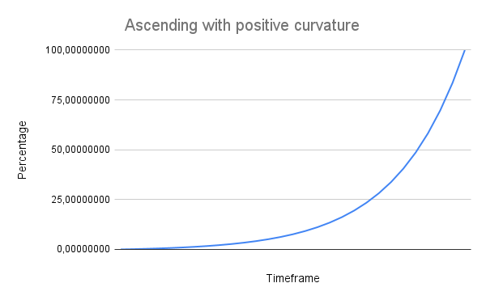

# EXPCurves

This smart contract implements an advanced exponential curve formula designed to handle various time-based events such as token vesting, game mechanics, unlock schedules, and other timestamp-dependent actions. The core functionality is driven by an exponential curve formula that allows for smooth, nonlinear transitions over time, providing a more sophisticated and flexible approach compared to linear models.

### What's inside?

- A Solidity smart contract implementation of the exponential curve function.
- A smart contract with a brokendown formula of the exponential curve implemented in Solidity
- A [spreadsheet](https://docs.google.com/spreadsheets/d/1E4cLaAw3_9PI2IjZINoQz9u353N1NMxVicfYhctU_MM/edit?usp=sharing) with the formula and the expected results for each stage, as well as a visual representation of the curve's progression over time
- Individual tests for each stage of the exponential curve formula used in the smart contract
- Valocracy Demo: a simpler version of [Valocracy](https://valocracy.xyz) to show how we can use the exponential curve to create a time-based governance power system, where governance power fades away over time unless more contributions are made

### How it works?

The exponential curve formula used in this smart contract has two variations - ascending and descending. The ascending curve starts at 0% and increases to 100% over time, while the descending curve starts at 100% and decreases to 0% over time. Both curves are controlled by the following formula:

#### Ascending Curve

$$\frac{\exp(k \cdot \frac{t - t_0}{T - t_0}) - 1}{\exp(k) - 1} \cdot 100$$

#### Descending Curve

$$\frac{\exp(k \cdot (1 - \frac{t - t_0}{T - t_0})) - 1}{\exp(k) - 1} \cdot 100$$

Where:

- t is the current timestamp
- t0 is the start timestamp
- T is the end timestamp
- k is the curvature factor, determining the steepness of the curve (2 decimals precision)
- exp() is the exponential function with base 'E' (Euler's number, approximately 2.71828)

The curvature factor (k) allows for fine-tuning the curve's shape, providing a wide range of possibilities for customizing the curve's behavior. A higher k value results in a steeper curve, while a lower k value results in a flatter curve. This flexibility enables developers to create complex time-based scenarios with precise control over the curve's progression. For better precision, the curvature factor is an integer with two (2) decimal places, allowing for a range of -100.00 to 100.00.



Check out the [docs](https://github.com/0xneves/EXPCurves/blob/main/docs) for more variations of the curve to have insights on how to use it in your project.

## How to use it?

The smart contract provides a function called `expcurve` that calculates the curve's decay value at a given timestamp based on the initial timestamp, final timestamp, curvature, and curve direction (ascending or descending). The function returns the curve value as a percentage (0-100) in the form of a fixed-point number with 18 decimal places.

- The `initialTimeframe` must be less than or equal to the `currentTimeframe`
- The `initialTimeframe` must be less than the `finalTimeframe`
- The `curvature` cannot be zero
- The `curvature` must fit between `-100.00` and `100.00` (-10_000 ~ 10_000 int16 with 2 decimals precision)
- The curve direction when `true` is ascending and when `false` is descending

```solidity
function expcurve(
    uint32 currentTimeframe,
    uint32 initialTimeframe,
    uint32 finalTimeframe,
    int16 curvature,
    bool ascending
  ) public pure virtual returns (int256);
```

You should make a copy of this [spreadsheet](https://docs.google.com/spreadsheets/d/1E4cLaAw3_9PI2IjZINoQz9u353N1NMxVicfYhctU_MM/edit?usp=sharing) and use it to calculate the curve values for your specific scenario. The spreadsheet provides a visual representation of the curve's progression over time, allowing you to fine-tune the curve parameters to achieve the desired effect.

## Installation

To install this repository, you can clone it and install the dependencies using the your package manager of choice. For example, using `yarn`:

```bash
yarn install
```

## Tests

To run the tests, you can use the following command:

```bash
yarn test
```

## Coverage

To check the test coverage, you can use the following command:

```bash
yarn coverage
```

You can match the results printed in the console logs with the expected results in the [spreadsheet](https://docs.google.com/spreadsheets/d/1E4cLaAw3_9PI2IjZINoQz9u353N1NMxVicfYhctU_MM/edit?usp=sharing). The same dataset were used to generate the curves in the spreadsheet and the tests. Check [constants.ts](test/constants.ts) for the dataset used in the tests.

## Inspired by Valocracy & ENS

EXPCurves was inspired by [Valocracy](https://github.com/valocracy/valocracy-contracts?tab=readme-ov-file) and [ENS](https://github.com/ensdomains) where both projects have a usage for the exponential curve. Valocracy uses the curve to decrease soul-bounded governance power over time and ENS uses the curve to decrease the price of [premium](https://github.com/ensdomains/ens-contracts/blob/c15e4afd5f1e886094459e5e74d21dd080704443/contracts/ethregistrar/ExponentialPremiumPriceOracle.sol#L6) for an expired domain over time.

This formula is not easy to implement in Solidity and there is nowhere to find a complete, dynamic and easy to use, implementation of it. This repository aims to fill this gap and provide scalar curves so that all projects can harness its power and manage time-based events in a more sophisticated way.

## Security

Although I maintain stringent standards for code quality and test coverage, it's important to note that this project may not be entirely secure. EXPCurves has not undergone an independent security audit yet.

## Acknowledgments

Appreciate the awesome library of [PaulRBerg](https://github.com/PaulRBerg) and the contributors enrolled with [prb-math](https://github.com/PaulRBerg/prb-math) which allowed EXPcurves to be possible.

## Contact

If you find any security issues, please report them via [Telegram](https://t.me/zeroxneves).

## License

This project is licensed under the MIT License - see the [LICENSE](LICENSE) file for details.

$$
$$
